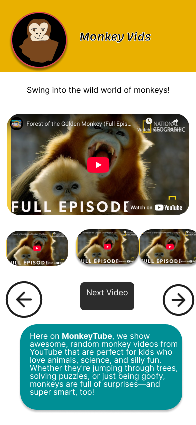
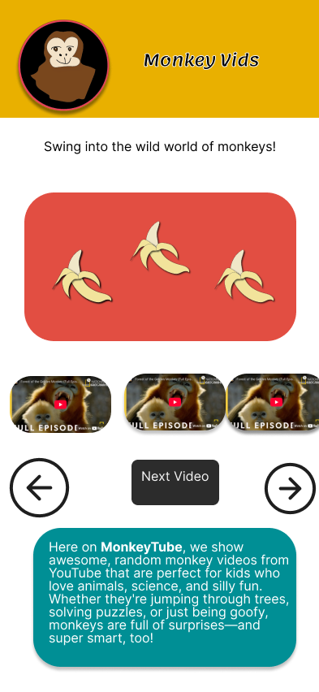
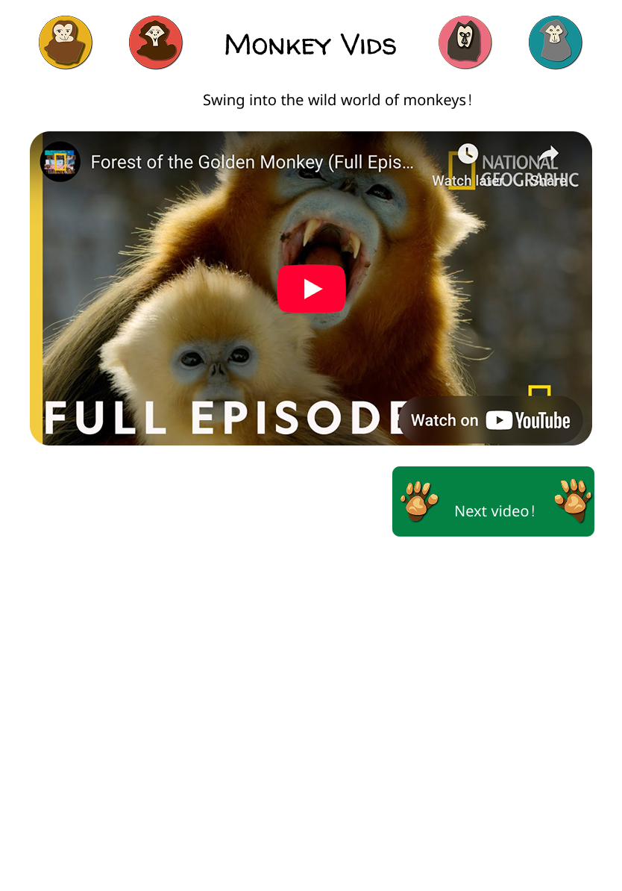
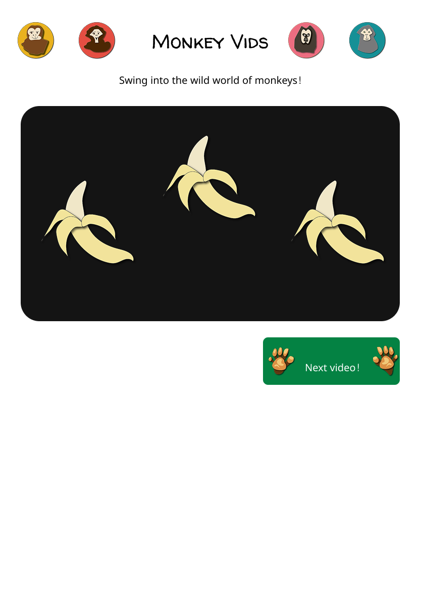
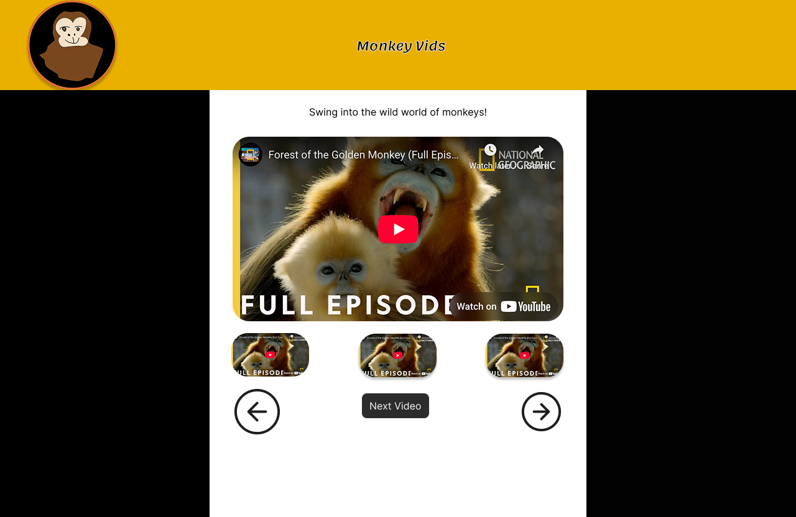
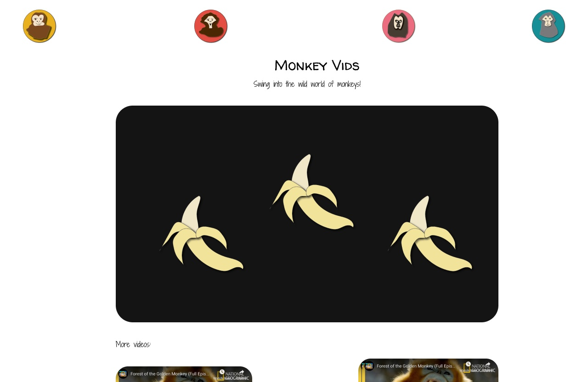

# MonkeyVids


Get a random monkey video

Deployed site: https://monkeyvids.onrender.com/ 

## Installation

1. Get a Youtube API data key using the instructions here: https://developers.google.com/youtube/v3/getting-started

2. Create a .env file and add the API data key

```
API_KEY = 'YOUR_API_KEY_HERE'
```
3. In your terminal, navigate into this repo and run 
```shell
  npm i
  nodemon ./server.js localhost 3000 
```

4. Go to 'http://localhost:3000/'

## UX/UI

### Target Audience

This app is aimed at young kids who enjoys short, funny videos that also teach them something new, especially about animals or science. The UI should be simple and easy to navigate. I will use vibrant colors, and fun animations to keep users engaged.

I would also like to make this app dark-mode friendly.

### Process

For this application, I drew all the icons (the monkey portraits, monkey paws, etc) in Adobe Illustrator. I created the wireframes in Figma.

### Wireframes













## Features

### MVP 

1. Get a random monkey Youtube video using the Youtube API (or from a backup list of videos if you have exceeded the daily Youtube API limit)
2. Get a new video you haven't seen before each time you click the 'Next Monkey!' video

### Post-MVP 

1. Traverse YouTube API pagination using 'nextPageToken' parameter to fetch additional results. 
2. Display a grid of videos, instead of using the 'next' button

## Usage

## Contributing

Pull requests are welcome. For major changes, please open an issue first
to discuss what you would like to change.

Please make sure to update tests as appropriate.

## License

[MIT](https://choosealicense.com/licenses/mit/)

## References

https://www.npmjs.com/package/dotenv